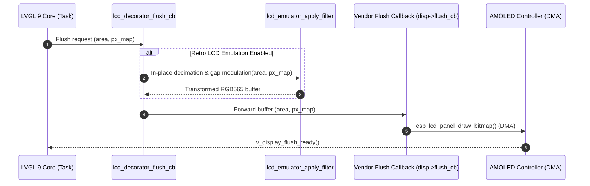

# Theory of Operation - Retro LCD Emulator Component (`TOO.MD`)

## 1. Overview & Purpose
The `lcd_emulator` component enables high-density color OLED/TFT displays running LVGL 9 (such as the 466×466 circular AMOLED on MiniGauge56) to emulate authentic monochrome dot-matrix reflective LCDs (e.g. Game Boy DMG, Nokia 5110, Casio digital watches, or industrial amber displays).

It achieves this through **screen-space modulo pixel decimation** and **procedural sub-pixel matrix gap modulation** during display flushing, without requiring changes to existing high-resolution vector UI layouts or modifying vendor display drivers in `managed_components/`.

---

## 2. Architecture & The Decorator Pattern

Vendor Board Support Packages (BSPs) typically register a hardware-specific flush function that transmits pixel maps directly to the display controller over SPI/QSPI DMA.

To interject without modifying read-only vendor components:
1. `lcd_emulator_init(disp)` inspects the active LVGL display handle `lv_display_t *disp`.
2. It retrieves the vendor's internal flush function pointer: `disp->flush_cb`.
3. It installs `lcd_decorator_flush_cb()` as the new active flush callback.
4. When LVGL completes rendering a dirty tile, `lcd_decorator_flush_cb()` is invoked.
5. If emulation is active, the dirty tile pixels are transformed in-place.
6. The buffer is forwarded to `s_orig_flush_cb()`, executing the native vendor DMA transmission pipeline.

---

## 3. Screen-Space Modulo & Tile Boundary Continuity

In LVGL 9, displays typically operate in partial redraw mode (e.g., 50-line buffers). A dirty rectangle is defined by `area->x1`, `area->y1`, `area->x2`, `area->y2`.

If decimation were computed relative to the local buffer index `(x, y)`, partial redraws would suffer from phase distortion and seam artifacts.

To guarantee bit-exact spatial continuity across arbitrary tile boundaries:
1. Every calculation maps to absolute physical screen space:
   $$x_{\text{screen}} = \text{area}\rightarrow x_1 + x_{\text{local}}$$
   $$y_{\text{screen}} = \text{area}\rightarrow y_1 + y_{\text{local}}$$
2. Sub-pixel matrix gap condition:
   $$\text{is\_gap\_x} = (x_{\text{screen}} \pmod{\text{cell\_size}}) \ge (\text{cell\_size} - \text{gap\_size})$$
   $$\text{is\_gap\_y} = (y_{\text{screen}} \pmod{\text{cell\_size}}) \ge (\text{cell\_size} - \text{gap\_size})$$
3. Gap pixels receive the physical separator substrate color (`palette.color_gap`).

---

## 4. In-Place Band Processing (Multi-Pixel Box Sampling & Stroke Preservation)

When transforming a tile in-place, reading an anchor pixel from an earlier scanline that was already overwritten would cause state corruption. Furthermore, sampling only a single center pixel per cell causes thin 1px font strokes or needle vectors to be skipped (aliasing dropout).

To eliminate read corruption and preserve fine vector strokes with zero dynamic memory allocation:
1. The dirty tile is partitioned into horizontal cell bands of height $\le \text{cell\_size}$.
2. **Pass 1 (Read-Only Multi-Pixel Box Sampling)**:
   For every cell column $c$ in the band, the algorithm samples across the active non-gap pixels of the cell:
   - For dark-theme UIs (AMOLED `#000000` background with bright text):
     If ANY pixel within the cell has luminance $Y \ge \text{threshold}$, the cell is marked active ($1$), and scanning early-exits for that cell.
   - For light-theme UIs (white canvas with dark ink):
     If ANY pixel within the cell has luminance $Y < \text{threshold}$, the cell is marked active ($1$).
   - Luminance is computed using ITU-R BT.601 integer arithmetic:
     $$Y = (77 R + 150 G + 29 B) \gg 8$$
   - Inverted mode polarity inverts the active flag ($1 \leftrightarrow 0$).
   - The resulting states are cached in a statically allocated 256-byte stack array `cell_active[]`.
3. **Pass 2 (Write-Only Overwrite)**:
   All scanlines in the cell band are overwritten with `palette.color_gap`, `palette.color_active`, or `palette.color_inactive`.

This guarantees:
- Zero dynamic memory allocation (`malloc`/`free`) in the hot rendering path.
- Zero read-after-write hazards.
- Complete geometric preservation of fine 1px font stems, needles, and borders.
- Bit-exact visual reproduction across any buffer tile height.
