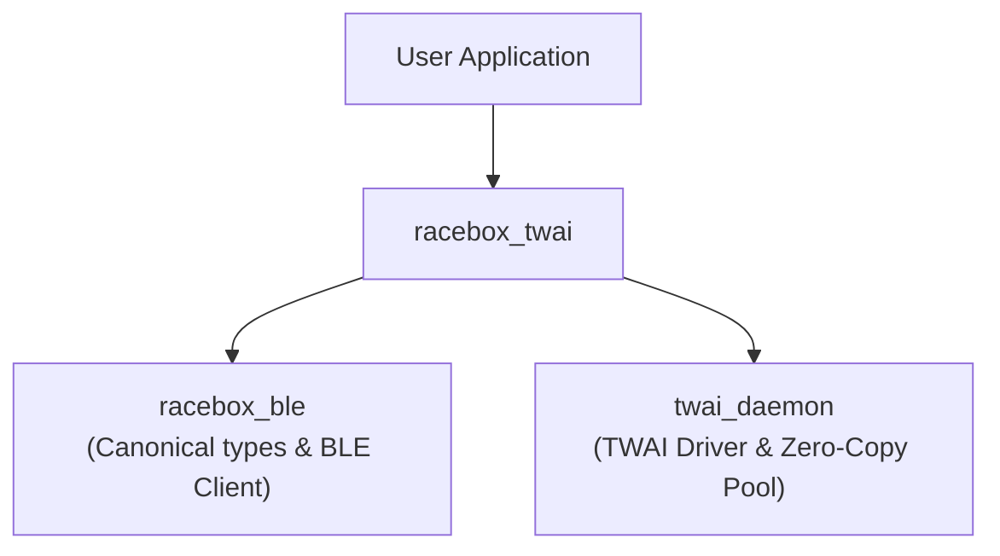

# How-To Guide: `racebox_twai` Component

## 1. Overview & Capabilities
The `racebox_twai` component formats, schedules, and broadcasts RaceBox GPS and IMU telemetry onto an automotive CAN network using the ESP32-S3 TWAI controller.

Key capabilities:
- **11-Bit Standard CAN Message Packaging** (`racebox_can_types.h`): Packed Intel Little-Endian structures for messages `0x600` through `0x605` matching the official Vector DBC database ([`docs/racebox_companion.dbc`](../../docs/racebox_companion.dbc)).
- **Asynchronous Decoupled FreeRTOS Queue** (`racebox_twai.h/.c`): Statically allocated 8-slot queue (`s_pvt_queue`) and worker task (`rb_twai_task`) preventing CAN bus stalls from blocking upstream tasks.
- **Turnkey Subsystem Orchestrator** (`racebox_companion.h/.c`): Modular top-level wrapper that configures NVS, BLE scanning, and CAN broadcasting in a single idempotent call.

---

## 2. Component Inter-Dependencies & CMake Integration



### Dependency Rationale:
1. **`twai_daemon`**: Required by `racebox_twai` for on-chip TWAI peripheral initialization, interrupt-driven TX pool descriptors, and bus-off recovery.
2. **`racebox_ble`**: Required for canonical telemetry definitions (`racebox_types.h`) and by the turnkey orchestrator (`racebox_companion.h`) to route BLE frames into CAN.

### In your project or component `CMakeLists.txt`:
```cmake
idf_component_register(
    SRCS "your_app.c"
    INCLUDE_DIRS "."
    REQUIRES racebox_twai racebox_ble twai_daemon
)
```

---

## 3. Integration Patterns

### Pattern A: Turnkey RaceBox Companion (Full BLE-to-CAN Pipeline)
The simplest way to embed RaceBox-to-CAN functionality into any firmware project. In just a few lines of code, it handles NVS, BLE Central auto-connect, and 25 Hz CAN broadcasting:

```c
#include <stdio.h>
#include "esp_log.h"
#include "racebox_companion.h"

static const char *TAG = "companion_example";

// Optional telemetry hook for application logic (display, logging, SD card)
static void on_telemetry(const racebox_pvt_t *pvt, void *user_data)
{
    ESP_LOGI(TAG, "Speed: %.1f km/h | 3D Fix: %d | Lat: %.6f, Lon: %.6f",
             pvt->speed_kmh, pvt->fix_status, pvt->latitude_deg, pvt->longitude_deg);
}

void app_main(void)
{
    racebox_companion_config_t config = {
        .name_prefix      = "RaceBox ", // Filter target devices
        .auto_can_forward = true,       // Automatically forward all 25 Hz frames to CAN
        .pvt_cb           = on_telemetry, // Optional application callback
        .ble_evt_cb       = NULL,
        .user_data        = NULL,
    };

    // 1. Initialize NVS, TWAI CAN, and NimBLE (guarded against double initialization)
    ESP_ERROR_CHECK(racebox_companion_init(&config));

    // 2. Start BLE discovery and automatic streaming
    ESP_ERROR_CHECK(racebox_companion_start());
}
```

---

### Pattern B: Direct CAN Telemetry Dispatch (Without BLE)
If you already receive RaceBox telemetry from an alternate source (e.g. wired UART, USB serial, simulation, or Ethernet), you can use `racebox_twai` directly to broadcast onto CAN:

```c
#include "racebox_twai.h"
#include "racebox_can_types.h"

void process_custom_telemetry(const racebox_pvt_t *pvt)
{
    // Initialize CAN subsystem once
    racebox_twai_init();

    // Enqueue telemetry non-blockingly into the FreeRTOS dispatch worker
    // (If the CAN bus is congested or recovering from bus-off, frames drop safely without blocking)
    esp_err_t err = racebox_twai_enqueue_pvt(pvt);
    if (err != ESP_OK) {
        // Queue was full, frame dropped safely
    }
}
```

---

### Pattern C: Real-Time Stream & Bus Diagnostics
You can query system health, heap consumption, queue depth, and CAN bus load at any time:

```c
racebox_companion_stats_t stats;
racebox_companion_get_stats(&stats);

printf("BLE Decoded: %u frames | Checksum Errs: %u\n",
       stats.ble_parser.frames_received,
       stats.ble_parser.frames_checksum_error);

printf("CAN Sent: %u frames (%.1f fps, ~%.1f%% bus load) | Failed: %u\n",
       stats.twai_stats.frames_sent_total,
       stats.twai_stats.can_tx_fps,
       stats.twai_stats.bus_utilization_pct,
       stats.twai_stats.tx_failed);

printf("Queue Depth: %u (Peak: %u, Drops: %u)\n",
       stats.twai_stats.queue_depth_current,
       stats.twai_stats.queue_depth_peak,
       stats.twai_stats.tx_queue_dropped);

printf("Free Heap: %u bytes (Historic Min: %u bytes)\n",
       stats.free_heap_bytes,
       stats.min_free_heap_bytes);
```

---

## 4. Hardware Pinout & Kconfig Options
Configure via `idf.py menuconfig` -> `RaceBox CAN Configuration`:
- **Base CAN ID**: `CONFIG_RACEBOX_CAN_BASE_ID` (Default: `0x600`). Telemetry messages span `Base + 0` through `Base + 5`.
- **Default Pinout**: `CONFIG_CAN_TX = 2`, `CONFIG_CAN_RX = 3`.
- **Default Baud Rate**: `500 kbps`.
- **CAN Bus Transmission Statistics**: `CONFIG_RACEBOX_TWAI_STATS_ENABLE` (Default: `y`). When disabled, eliminates all statistics tracking overhead in the transmission path. `racebox_twai_get_stats` returns `ESP_ERR_NOT_SUPPORTED`.
- **Message Rate Dividers**: Each of the 6 CAN messages can be individually tuned to 25 Hz, 10 Hz, 5 Hz, 1 Hz, or Disabled (`OFF`).

