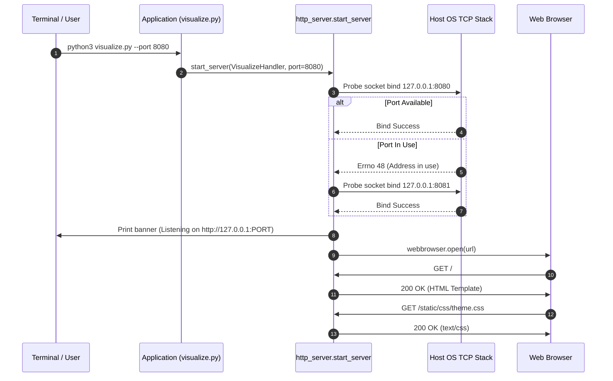
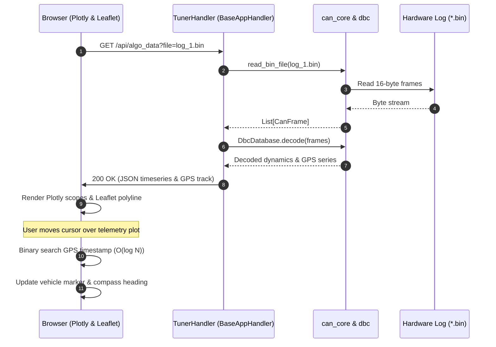
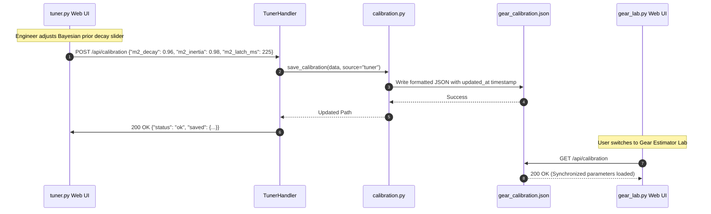
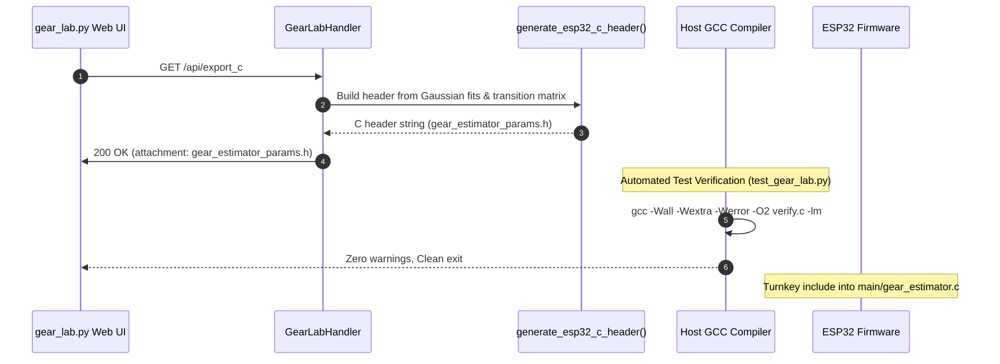
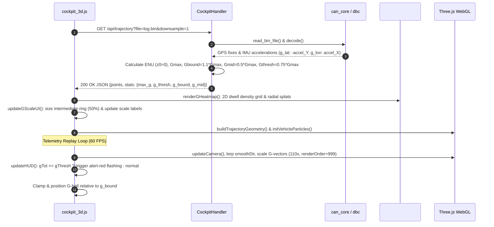

# MiniGauge Decoder Toolset — Theory of Operation (TOO.MD)

## 1. System Overview & Architecture

The MiniGauge Decoder Toolset is an offline telemetry analysis, algorithm engineering, and log manipulation workstation. It is engineered to process binary CAN bus captures (`*.bin`) recorded by the MiniGauge ESP32 firmware and provide interactive, real-time visualization, calibration, and firmware C99 code generation.

### 1.1 Architectural Decoupling & Modularity

The toolset follows a modular layered architecture:

```
+-------------------------------------------------------------------------------+
|                            BROWSER CLIENT INTERFACE                           |
|  [HTML5 Templates]        [Centralized CSS Design System]   [Modular JS Libs] |
|  - visualize.html         - theme.css (Dark/Light tokens)   - theme.js        |
|  - tuner.html             - base.css (Layout, Reset)        - toast.js        |
|  - gear_lab.html          - components.css (Cards, Sliders) - leaflet_map.js  |
|  - trim_log.html          - map.css (GPS Drawer, HUD)       - plotly_theme.js |
|  - cockpit_3d.html        - cockpit_3d.css (HUD, Glow)      - cockpit_3d.js   |
+---------------------------------------+---------------------------------------+
                                        | HTTP / JSON / Static Assets
+---------------------------------------v---------------------------------------+
|                       PYTHON OFFLINE APPLICATION LAYER                        |
|   visualize.py    tuner.py      gear_lab.py     trim_log.py    cockpit_3d.py  |
+---------------------------------------+---------------------------------------+
                                        | Shared Services
+---------------------------------------v---------------------------------------+
|                          DECODER COMMON LIBRARY (common/)                     |
|   can_core.py            dbc.py             calibration.py    http_server.py  |
|   - CanFrame             - DbcDatabase      - load_cal        - BaseAppHandler|
|   - read_bin_file        - SignalDef        - save_cal        - start_server  |
|   - find_bin_files       - MessageDef       - sync aliases    - MIME / routing|
+---------------------------------------+---------------------------------------+
                                        | Binary Unpacking & Database
+---------------------------------------v---------------------------------------+
|  Hardware Logs (*.bin)                 CAN Database (binocan.dbc)             |
|  16-byte Little-Endian Frames          Motorola / Intel Packed Signals        |
+-------------------------------------------------------------------------------+
```

---

## 2. Core Components

### 2.1 Low-Level CAN Engine (`decoder/common/can_core.py`)
- **`CanFrame`**: Immutable record container representing a single hardware frame. Supports both 4-argument and 5-argument constructors, exposing canonical attributes `timestamp_ms`, `can_id`, `dlc`, `data`, and calculated time offsets `time_rel_s`.
- **`read_bin_file`**: Fast binary parser reading consecutive 16-byte records formatted as `<IHB8sx` (4-byte timestamp in ms, 2-byte CAN arbitration ID, 1-byte DLC, 8 bytes data payload, and 1-byte padding).
- **`find_bin_files`**: Multi-file discoverer with natural sorting (`log_2.bin` before `log_10.bin`).

### 2.2 CAN Database Parser (`decoder/common/dbc.py`)
- **`DbcDatabase`**: Zero-dependency parser for standard Vector DBC files. Resolves `BO_` (Message definitions), `SG_` (Signal definitions), `VAL_` (Enumerated value tables), and `SIG_VALTYPE_` (IEEE 754 floating point markers).
- **`MessageDef` & `SignalDef`**: Decode bitfields packed across byte boundaries supporting both Motorola (Big Endian) and Intel (Little Endian) schemes, physical linear conversions (`y = mx + b`), min/max clamping, and string value mappings. Aliased as `DbcMessage` and `DbcSignal` for backward compatibility.

### 2.3 Shared Calibration Store (`decoder/common/calibration.py`)
- Manages cross-tool algorithm synchronization via `decoder/gear_calibration.json`.
- Implements atomic file persistence with ISO-8601 timestamps and parameter aliasing between heuristic and Bayesian nomenclature (`tolerance` <=> `tolerance_abs`, `latch_ms` <=> `latch_time_ms`).

### 2.4 Reusable HTTP Server Framework (`decoder/common/http_server.py`)
- **`BaseAppHandler`**: Extends Python's `BaseHTTPRequestHandler` with convenience helpers for CORS preflight, JSON request extraction (`read_json_body`), response formatting (`send_json`), template streaming (`send_html`), and static file routing (`serve_static`).
- **`start_server`**: Threading HTTP server launcher featuring collision-free dynamic TCP port allocation, terminal diagnostic banners, and browser auto-launching.

### 2.5 3D Cyber-Cockpit & Trajectory Replayer (`decoder/cockpit_3d.py`)
- **`lat_lon_to_enu`**: High-precision local East-North-Up coordinate conversion relative to initial GPS anchor point, translating WGS84 coordinates to local meters with sub-millimeter precision.
- **`extract_cockpit_trajectory`**: Decodes CAN binary records into 3D spatial points with synchronized engine (RPM, gear, temps), dynamic (speed, G-force, roll/pitch), and electrical telemetry (battery voltage, tell-tales).
- **Three.js WebGL Graphics Pipeline**: Renders 3D trajectory ribbons with instantaneous speed heatmapping, greyed-out future horizon, vertical reference stanchions extending to the $0\text{m}$ ground plane, vehicle frame 3D G-vector arrows, fixed-frustum non-culling 1200-particle trail, distance-smoothed lookahead chase camera ($45,000\text{m}$ render distance), tethered orbit camera tracking (preserving constant orbit radius), local smoothed road grade estimation ($\pm 25\text{m}$ spatial window), and live vertical exaggeration ($1.0\times$ to $5.0\times$).
- **`vx-binocle-espidf` Instrument Cluster**: Pure SVG needle-less perimeter gauges mathematically aligned with graduations for RPM (0–80 with $\times 100$ RPM sub-label) and Speed (0–240 KPH), centered numeric RPM and speed readouts, centered lower diagnostic readouts (`COOL`, `FUEL`), floating bottom gear dock, enlarged $192\text{px}$ uncontainerized G-meter with additive blending/summing dwell heatmap, red indicator dot, automatic red alert thresholding, and collapsible HUD controls.

---

## 3. Web Asset Delivery Strategy

Assets are organized into dedicated directories:
- **`decoder/web/static/css/`**:
  - `theme.css`: Color tokens for Ubuntu Yaru Dark and Cold White Light, supporting live switching via CSS custom properties.
  - `base.css`: CSS reset, typography, responsive flexbox layout, and headers.
  - `components.css`: Reusable UI controls including buttons, dynamic-gradient sliders, cards, data tables, and badges.
  - `map.css`: Collapsible Leaflet GPS drawer, velocity HUD, and rotating compass styling.
  - `cockpit_3d.css`: Cyberpunk negative-space HUD layout, glassmorphic panels, neon glow filters, and collapsible bar animations.
- **`decoder/web/static/js/`**:
  - `theme.js`: OS `prefers-color-scheme` listener with `localStorage` persistence and `minigauge-theme-changed` dispatch.
  - `toast.js`: Non-intrusive notification banner manager.
  - `plotly_theme.js`: Plotly layout generators syncing dark/light modes and container ResizeObservers.
  - `leaflet_map.js`: Leaflet GPS track drawer with binary search telemetry synchronization.
  - `cockpit_3d.js`: Three.js WebGL scene lifecycle, speed heatmap shader, warp particle system, G-force camera roll, and dual-screen SVG gauge updating.
- **`decoder/web/templates/`**:
  - `visualize.html`, `tuner.html`, `gear_lab.html`, `trim_log.html`, and `cockpit_3d.html`.
  - Clean HTML5 documents containing zero inline style blocks or embedded third-party script definitions.

---

## 4. Sequence Diagrams

### 4.1 Server Startup & Dynamic Port Allocation



### 4.2 Telemetry Ingestion & GPS Synchronization Loop



### 4.3 Cross-Tool Parameter Tuning & Calibration Sync



### 4.4 Embedded C Header Generation & GCC Verification



### 4.5 3D Cyber-Cockpit, G-Meter Normalization & Friction Circle Heatmap



---

## 5. Security & Operational Boundaries

1. **Localhost Binding Invariant**: By default, all HTTP services bind strictly to loopback (`127.0.0.1`), ensuring services are never exposed to external networks without deliberate intent.
2. **Directory Traversal Protection**: `BaseAppHandler.serve_static` enforces strict path resolution relative to `decoder/web/static`. Any requested path resolving outside the static asset root is rejected with `HTTP 403 Forbidden`.
3. **No External Runtime Fetch**: All client libraries (Leaflet, Plotly) fall back to local assets or CDN links gracefully, and zero pip packages are loaded on the host runtime.

