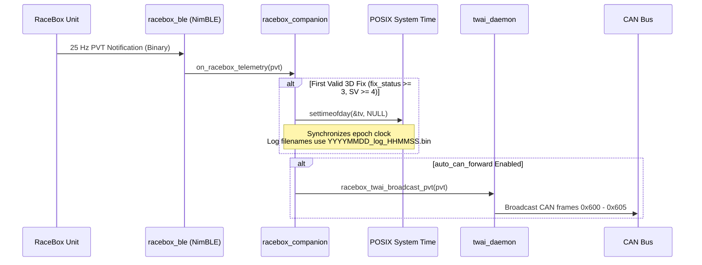
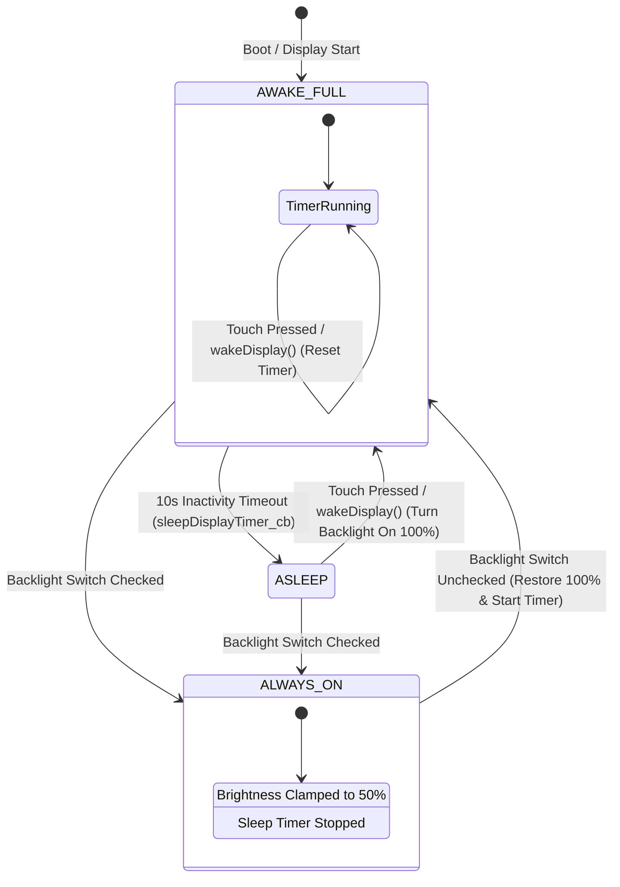

# MiniGauge56 — Theory of Operation (TOO)

## 1. System Architecture Overview

MiniGauge56 is an automotive instrument cluster companion and telemetry bridge designed for the ESP32-S3 dual-core microcontroller. It bridges vehicle CAN networks, wireless GNSS/IMU telemetry, high-throughput SD card data logging, and interactive user visualization on a 1.75" AMOLED capacitive touch display.

```mermaid
graph TD
    subgraph External Transports
        RB[RaceBox Mini / Micro / S] -->|BLE 5.0 GATT Notifications| BLE_MOD[racebox_ble Central]
        BUS[Vehicle CAN Bus / Transceiver] <-->|TWAI ISO 11898-2| TWAI_MOD[twai_daemon]
    end

    subgraph Core 1: Ingestion & Telemetry Processing
        BLE_MOD -->|pvt_cb| COMP[racebox_companion]
        COMP -->|Clock Sync settimeofday| RTC[(ESP32 RTC)]
        COMP -->|racebox_twai_broadcast| TWAI_MOD
        TWAI_MOD -->|app_can_frame_router| ROUTER{CAN Router}
        ROUTER -->|log_can_frame_handler| RB_BUF[(PSRAM Ringbuffer - 32 KB)]
        ROUTER -->|binocan_*_unpack| CAN_SIG[CAN Signals: Speed / RPM Freq]
    end

    subgraph Core 0: Storage, Estimation & Graphics
        RB_BUF -->|xRingbufferReceiveUpTo| SD_TASK[sd_writer_task]
        SD_TASK -->|DMA Block Writes 8 KB| SD[(FATFS MicroSD Card)]
        CAN_SIG -->|speed_freq / rpm_freq| GEAR_TASK[update_gear_estimator - 40 Hz]
        GEAR_TASK -->|Bayesian Filter & Latch| GEAR_ST[(gear_estimator State)]
        GEAR_ST -->|latched_gear| UI_TASK[update_display - 10 Hz]
        CAN_SIG -->|telemetry metrics| UI_TASK
        UI_TASK -->|LVGL Mutex bsp_display_lock| AMOLED[RM69090 AMOLED Display]
    end
```

---

## 2. Hardware Subsystems

### 2.1 Microcontroller & Memory Architecture
- **ESP32-S3-WROOM-1**: Xtensa Dual-Core 32-bit LX7 CPU running at 240 MHz.
- **PSRAM Allocation**: 8 MB Octal SPI PSRAM. Utilized for non-blocking telemetry buffering (`can_rb`, 32 KB) and DMA buffer staging.
- **Core Partitioning**:
  - **Core 0**: LVGL display task, SD card DMA block writer task (`sd_writer_task`), and Bayesian gear estimator task (`upd_gear`).
  - **Core 1**: FreeRTOS timer daemon, Apache NimBLE Bluetooth Central stack, and `CAN_RX_Task` worker (`CONFIG_CAN_CORE_AFFINITY=1`).

### 2.2 Peripheral Interfacing
- **TWAI CAN Controller**: Native ESP32-S3 on-chip TWAI controller routed to external transceiver via `GPIO 43` (TX) and `GPIO 44` (RX) configured for 500 kbps bit rate.
- **MicroSD Interface**: 4-wire SDMMC/SPI routed to `/sdcard` through ESP-IDF VFS FATFS.
- **AMOLED Display**: Waveshare 1.75" 466x466 capacitive touch AMOLED panel driven by RM69090 controller over QSPI, accompanied by CST9217 touch controller over I2C.

---

## 3. Data Ingestion & Dispatch Loops

### 3.1 CAN Ingestion & Zero-Copy Logging
Incoming frames are captured via hardware interrupts into `twai_daemon`'s queue and dispatched sequentially:

```mermaid
sequenceDiagram
    participant BUS as Physical CAN Bus
    participant ISR as TWAI on_rx_done ISR
    participant RX_TSK as CAN_RX_Task (Core 1)
    participant ROUTER as app_can_frame_router
    participant LOGGER as log_can_frame_handler
    participant RB as PSRAM Ringbuffer
    participant SD_TSK as sd_writer_task (Core 0)
    participant SD as MicroSD Card

    BUS->>ISR: CAN Frame Received
    ISR->>RX_TSK: xQueueSendFromISR(g_twai_rx_queue)
    RX_TSK->>ROUTER: dispatchCANFrame(&rx_frame)
    ROUTER->>LOGGER: log_can_frame_handler(rx_frame)
    Note over LOGGER: Pack 16-byte record<br/>(timestamp, id, dlc, data)
    LOGGER->>RB: xRingbufferSend(can_rb, &record, 0)
    Note over LOGGER: Zero-wait; drops on full
    ROUTER->>ROUTER: Unpack Speed & RPM Signals (0x300, 0x301)
    
    loop Every 8 KB or 100 ms
        SD_TSK->>RB: xRingbufferReceiveUpTo(BLOCK_SIZE)
        RB-->>SD_TSK: Batch Buffer
        SD_TSK->>SD: fwrite(batch_buffer, BLOCK_SIZE)
    end
```

### 3.2 RaceBox BLE Telemetry & GPS Time Synchronization
The `racebox_companion` module searches for BLE advertisements matching `"RaceBox "` and registers GATT notification callbacks for high-rate PVT (Position, Velocity, Time) packets:



---

## 4. Bayesian Gear Estimation Model

### 4.1 Mathematical Formulation
The gear estimator predicts transmission state `g in {0, 1, 2, 3, 4, 5, 14}` (Neutral, Forward Gears 1 to 5, and Uncertain) using a kinematic-conditioned recursive Bayesian filter.

1. **State Space & Observation**:
   - `speed_freq`: Vehicle wheel/driveshaft pulse frequency (Hz).
   - `rpm_freq`: Engine tachometer pulse frequency (Hz).
   - Frequency Ratio: `r = speed_freq / rpm_freq`.

2. **Kinematic Derivative Estimation**:
   At each 25 ms evaluation step, derivatives are estimated with microsecond precision:
   - `dt = (now_us - prev_us) / 1000000.0`
   - `dsf = (speed_freq - prev_speed_freq) / dt`
   - `drf = (rpm_freq - prev_rpm_freq) / dt`

3. **Kinematic Transition Matrix T**:
   A 6x6 transition matrix is dynamically biased based on throttle and engine conditions:
   - High RPM (`rpm_freq >= 55.0 Hz`) and positive vehicle acceleration (`dsf >= 0.0 Hz/s`) bias transitions towards upshifts (`T[k][k+1] = 0.06`).
   - Rapid vehicle deceleration (`dsf < -3.0 Hz/s`) biases transitions towards downshifts (`T[k][k-1] = 0.06`).

4. **Gaussian Likelihood Calculation**:
   Given empirical ratio means `mu_gi` and variances `sigma_gi^2`:
   - `L(r | gear = gi) = exp(-0.5 * (r - mu_gi)^2 / sigma_gi^2) / sqrt(2 * pi * sigma_gi^2)`

5. **Clutch Drop Detection & False Upshift Suppression**:
   When the clutch is disengaged under power, the engine decelerates rapidly (`drf < -35.0 Hz/s`) while vehicle speed remains sustained (`dsf > -5.0 Hz/s`). The filter detects this condition and heavily attenuates higher gear likelihoods (`L(gi) *= 0.0001` for `gi > curr_gear`) to prevent phantom upshifts during gear shifts.

6. **Confidence & Latching Hysteresis**:
   - The posterior distribution is updated with exponential decay:
     `P(g_k) ~ L(g_k) * (decay * Pred(g_k) + (1 - decay) / 6)`
   - The candidate gear must maintain a posterior probability `>= 0.38` continuously for at least 200 ms before `latched_gear` transitions, eliminating transient flickering.

---

## 5. AMOLED Display & Power Management State Machine

The cluster display implements an automatic inactivity sleep timer alongside a user-selectable Always-On mode:



